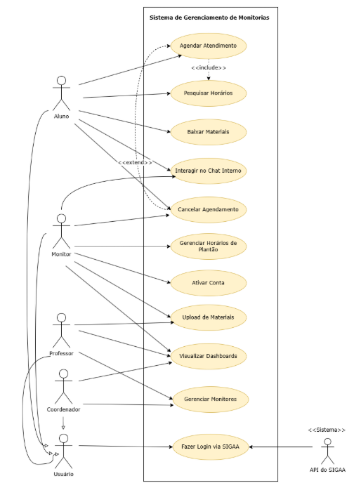
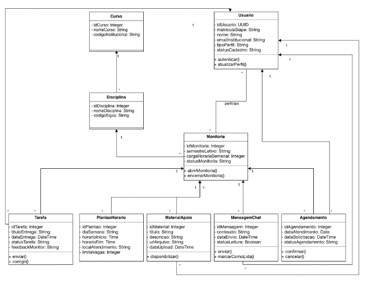
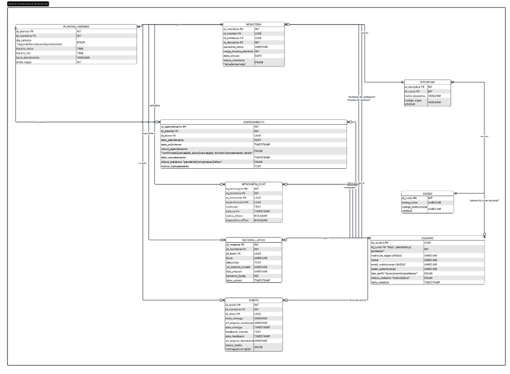

# Modelagem e Diagramas do Sistema

Este documento centraliza as modelagens visuais desenvolvidas para o planejamento da arquitetura e das regras de negócio do **Sistema de Gerenciamento de Monitorias**. 

Abaixo estão as representações do escopo de interações, estrutura estática e modelagem de dados da plataforma.

---

## 1. Diagrama de Casos de Uso

O Diagrama de Casos de Uso reflete diretamente os requisitos funcionais e as regras de negócio mapeadas, traduzindo as necessidades levantadas em interações visuais e garantindo a rastreabilidade do projeto.

---

## 2. Diagrama de Classes

A modelagem desenvolvida representa a estrutura estática do sistema, evidenciando as classes que compõem a aplicação, seus atributos, métodos e os relacionamentos existentes entre elas.

---

## 3. Diagrama Entidade-Relacionamento (DER)

Este diagrama representa de forma detalhada a estrutura lógica do banco de dados, evidenciando as entidades, atributos, chaves primárias, chaves estrangeiras e os relacionamentos existentes entre as tabelas (PostgreSQL). O DER Lógico foi elaborado com base nos requisitos funcionais e nas regras de negócio definidas para o sistema, proporcionando maior organização, consistência e integridade das informações.

